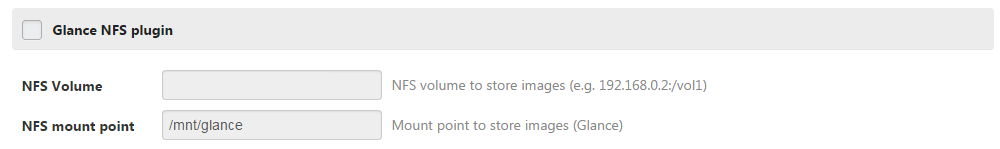

Fuel Glance-nfs plugin for Fuel
=============================

Glance-nfs plugin
---------------

Overview
--------
glance-nfs uses nfs backend to store images. This plugin allow to mount a nfs volume
annd use it as storage backend for Glance.

This repo contains all necessary files to build glance-nfs Fuel plugin.

Requirements
------------

| Requirement                      | Version/Comment                                         |
|----------------------------------|---------------------------------------------------------|
| Mirantis Openstack compatibility | 7.0                                                    |
| NFS Server                       | an NFS server with volume accessible from compute nodes |

Recommendations
---------------

None.

Limitations
-----------

Only on nfs volume can be defined. So in HA deployment controller nodes will share the same
storage backend for images.

Installation Guide
==================

Glance-nfs plugin installation
----------------------------

1. Clone the fuel-plugin repo from: https://github.com/stackforge/fuel-plugin-glance-nfs.git

    ``git clone``

2. Install the Fuel Plugin Builder:

    ``pip install fuel-plugin-builder``

3. Build glance-nfs Fuel plugin:

   ``fpb --build fuel-plugin-glance-nfs/``

4. The glance_nfs-<x.x.x>.rpm file will be created in the plugin folder (fuel-plugin-glance-nfs)

5. Move this file to the Fuel Master node with secure copy (scp):

   ``scp glance_nfs-<x.x.x>.rpm root@:<the_Fuel_Master_node_IP address>:/tmp``
   ``cd /tmp``

6. Install the glance-nfs plugin:

   ``fuel plugins --install glance_nfs-<x.x.x>.rpm``

7.  Verify that the plugin is installed correctly:
   ``fuel plugins --list``
   
8. Plugin is ready to use and can be enabled on the Settings tab of the Fuel web UI.

User Guide
==========

Glance-nfs plugin configuration
-----------------------------

1. Create a new environment with the Fuel UI wizard

2. Add a node with the "controller" role.

3. Click on the settings tab of the Fuel web UI

4. Scroll down the page, select the "glance-nfs plugin" checkbox
   and fill-in the requiered fields
    - the nfs volume to store images
    - the mount point for the nfs volume

Here is a screenshot of the fields

Deployment details
------------------

Create mountpoint directory
Edit Fstab to add auto mount of NFS volume on the mountpoint
Configure Glance to use it as backend for images
Restart Glance-api services

Known issues
------------

The deployment  failed if the NFS volume is not available during the deployment

Release Notes
-------------

**1.0.0**

* Initial release of the plugin

**2.0.0**

* Update plugin to Fuel 6.1 release

**3.0.0**

* Update plugin to Fuel 7.0 release

